# Brazilian E-commerce Public Dataset Analysis

This project showcases a complete end-to-end analysis of the Brazilian E-commerce Public Dataset. The goal is to extract insights regarding customer behavior, delivery efficiency, payment trends, product performance, and satisfaction, using real-world business KPIs and storytelling.

---

## 🧰 Tools Used
- Python (pandas, seaborn, matplotlib, wordcloud, textblob)
- Google Colab
- Jupyter-compatible markdown for storytelling

---

## 📦 Dataset Overview
- **Source**: Olist Public Dataset
- **Orders**: 100k+
- **Tables**: Customers, Orders, Order Items, Products, Payments, Reviews, Geolocation

---

## 🔗 Relational Structure & Dataset Merging Logic

To build meaningful insights, multiple dataset tables were joined using relational keys. Here’s an overview of the key relationships and why they were used:

- `orders` ⟶ `order_items` via `order_id`  
  → To link each order to the products it contains (for volume & revenue analysis)

- `orders` ⟶ `order_payments` via `order_id`  
  → To connect orders with payment method, value, and installment data

- `orders` ⟶ `order_reviews` via `order_id`  
  → To analyze customer satisfaction and sentiment based on actual order experience

- `orders` ⟶ `customers` via `customer_id`  
  → To add geographic info (`customer_state`) for regional delivery analysis

- `order_items` ⟶ `products` via `product_id`  
  → To map each item sold to its category and physical attributes

These relationships enabled segment-based analysis (e.g., RFM), performance tracking (delivery, payments), and sentiment breakdowns.

---

## 🧹 Data Cleaning & Preparation

Before diving into analysis, all datasets were inspected and preprocessed as follows:

- **Datetime conversion**:  
  Columns like `order_purchase_timestamp`, `order_delivered_customer_date`, `review_creation_date` were converted to datetime using `parse_dates` in `pandas.read_csv()`

- **Missing values**:  
  - `orders`: handled missing `order_delivered_customer_date`, `order_approved_at` (ignored non-delivered rows)  
  - `products`: missing values in `product_weight_g`, `product_length_cm` and `product_category_name` were analyzed; rows with nulls in critical fields were either filled or excluded  
  - `reviews`: many rows had no review comment — tracked via `has_comment` flag

- **Merging datasets**:  
  - Orders were merged with payments, products, customers, reviews using `order_id` or `customer_id`  
  - Filtering applied to keep only `order_status == 'delivered'`

- **Feature engineering**:  
  - `delivery_days` = delivered date – purchase date  
  - `delay` = delivered date – estimated delivery date  
  - `rfm_score` and segment classification based on quantiles

- **Text preprocessing (NLP)**:  
  - Comments lowercased and punctuation removed  
  - `TextBlob` used for sentiment polarity  
  - Word frequencies and word clouds for visual analysis

All transformations were executed using `pandas`, `numpy`, and `textblob` functions in Python.

---

## 1. RFM Segmentation (Recency, Frequency, Monetary)
We performed RFM analysis to segment customers based on how recently and frequently they purchased, and how much they spent.

### Key Findings:
- **Loyal Customers**: 27k
- **Champions**: 6.5k
- **At Risk**: 22k
- Repeat rate: ~3.1%

### Visualization:
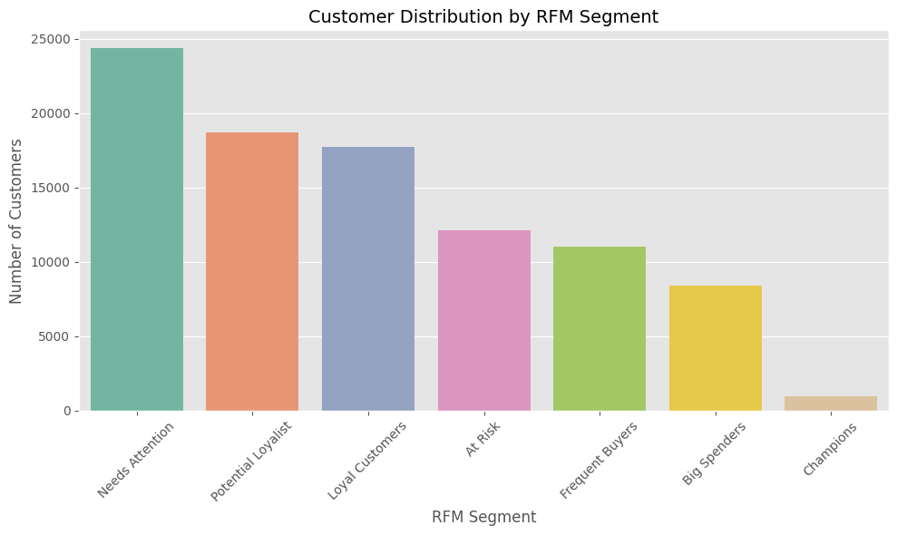

---

## 2. Delivery Performance Analysis
We calculated delivery delay as the difference between actual delivery date and the estimated delivery date.

### Key Metrics:
- **Average delivery time**: ~12 days
- **Average delay**: -11 days (delivered early)

### Segment Insights:
- `Hibernating` and `At Risk` segments had longer delivery times.
- Most delays occurred in categories with high freight (e.g. furniture).

### Visualization:
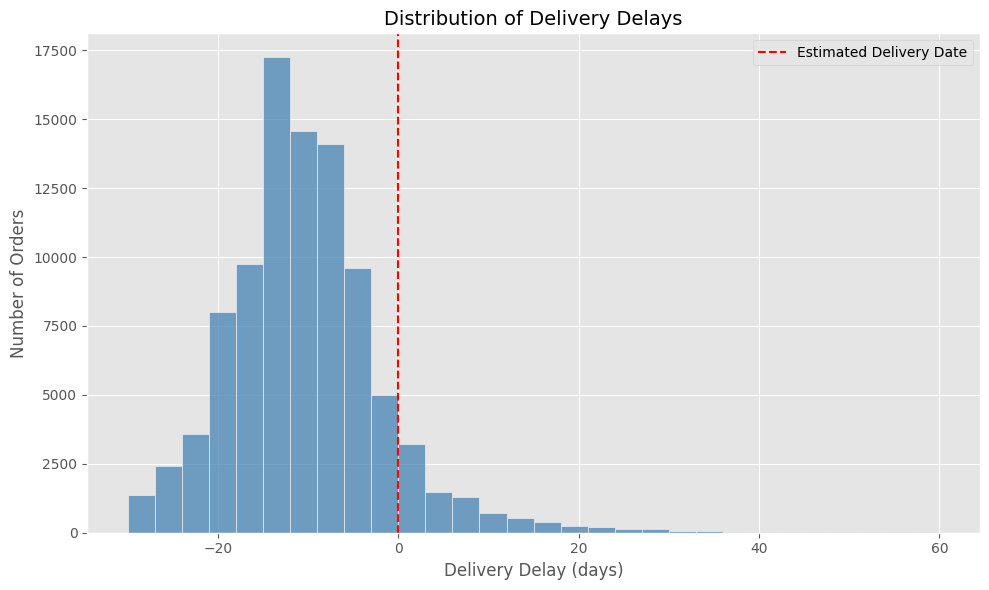
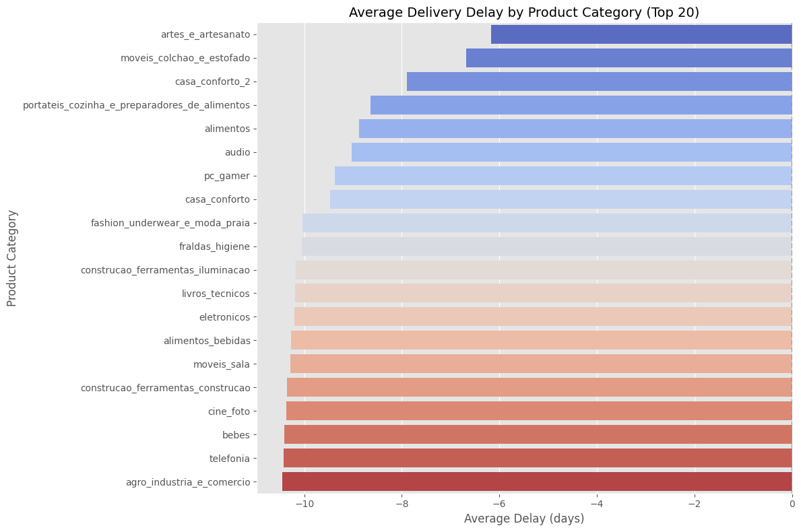
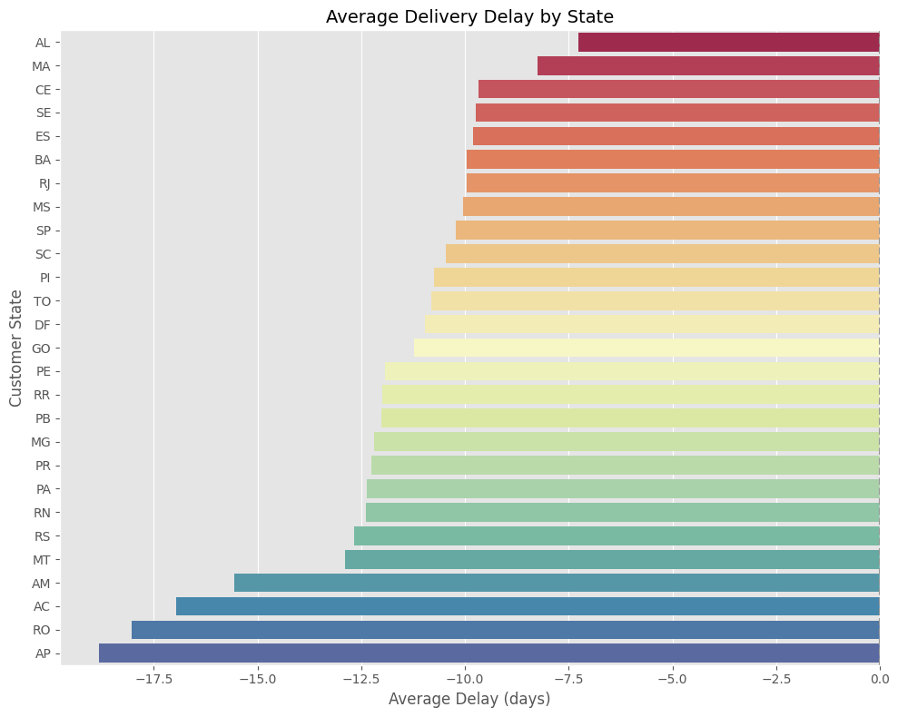

---

## 3. Payment Methods Analysis
We analyzed the breakdown of payment types, average values, and number of installments.

### Key Insights:
- **Credit Card** dominates: 74.5k transactions (3.5 installments on average)
- **Boleto** is used in 19k+ transactions, usually one-time payments
- **Voucher** used for low-value purchases (~€62 avg)

### Visualization:
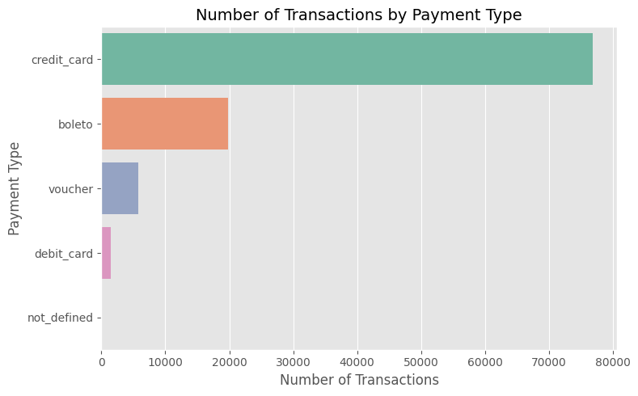
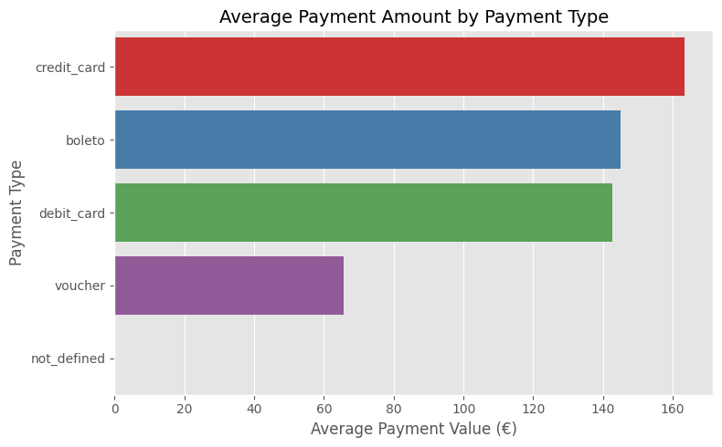

---

## 4. Product Performance Analysis
We examined which products and categories generate the most revenue and sales volume.

### Top Categories by Revenue:
- `beleza_saude`: €1.25M
- `relogios_presentes`: €1.2M
- `cama_mesa_banho`: €1.03M

### Top Products by Volume:
- `moveis_decoracao`, `cama_mesa_banho`, `ferramentas_jardim`

### Visualization:
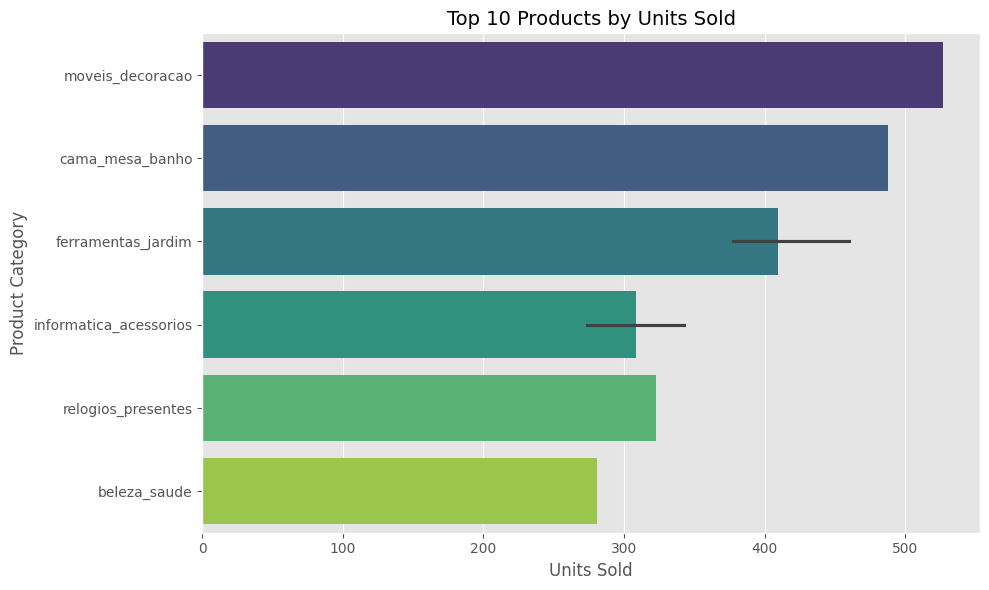
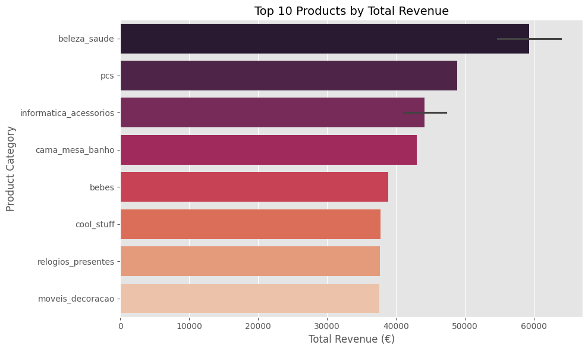
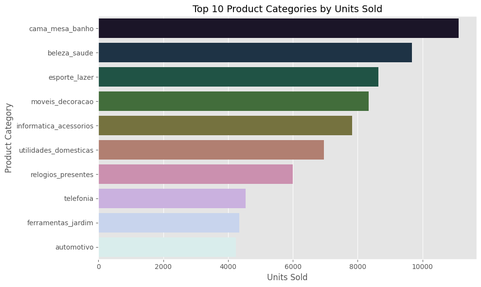
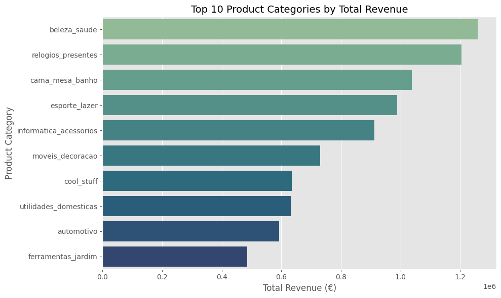

---

## 5. Customer Satisfaction (Review Analysis)
We merged review data with delivery performance and performed basic NLP analysis.

### Review Score Distribution:
- ⭐ 5: 57k reviews
- ⭐ 1: 11.4k reviews

### Delivery Time vs Review:
- ⭐ 5: Avg 10.2 days
- ⭐ 1: Avg 20.8 days
- Clear correlation between delays and low satisfaction

### Sentiment Polarity (TextBlob):
- ⭐ 1: 0.00
- ⭐ 5: 0.04

### Word Cloud & Keywords:
- 1★: "não recebi", "ainda", "problema"
- 5★: "chegou antes", "recomendo", "produto bom"

### Visualization:
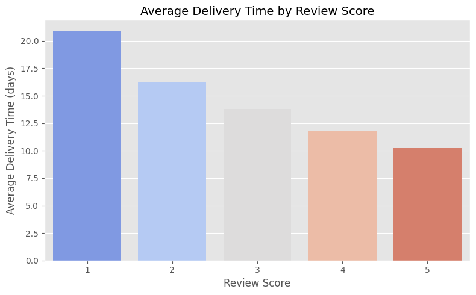
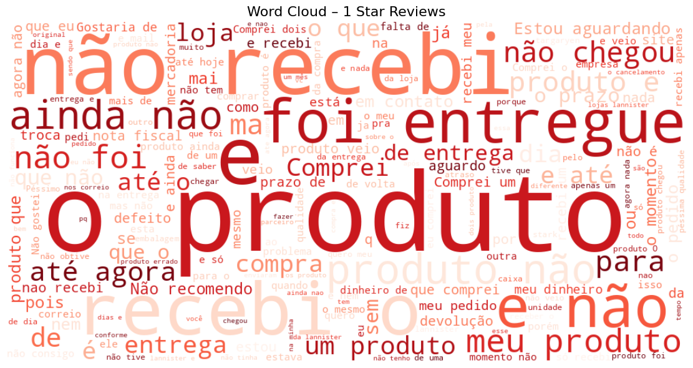
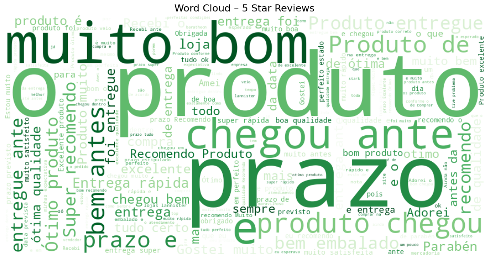

---

## 📌 Conclusion
This project demonstrates the power of combining customer-level metrics (RFM), operational KPIs (delivery & payments), and customer voice (reviews) to extract insights from raw e-commerce data. It reflects real-world analyst thinking across:
- Retention strategy
- Logistics performance
- Pricing behavior
- CX sentiment

---

## 🔗 Credits
Dataset from Kaggle: [Brazilian E-Commerce Public Dataset by Olist](https://www.kaggle.com/datasets/olistbr/brazilian-ecommerce)

Prepared and analyzed by **Christos Papakostas**, aspiring Data Analyst focused on storytelling through data.

---
